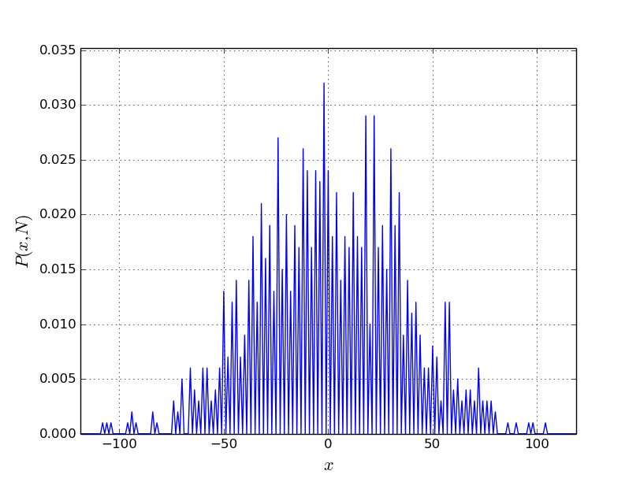
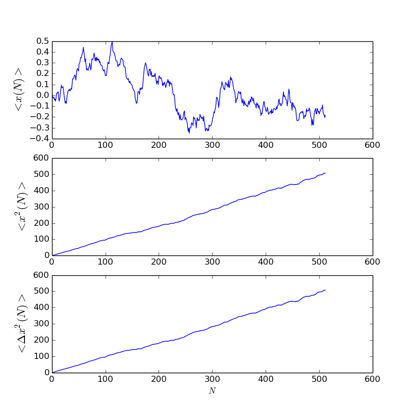
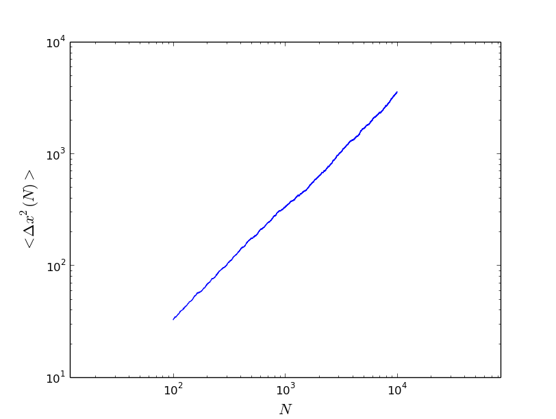
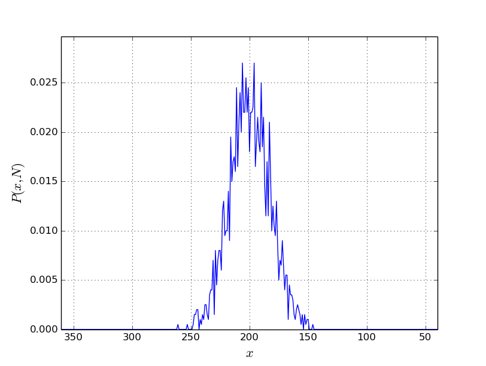

.. _12-4-label:

=====================================================
問題12-4 - 継続型ランダムウォーク
=====================================================

.. contents::

シミュレーションの目的
============================

このシミュレーションでは、継続型ランダムウォーク、すなわち一つ前の遷移の履歴が遷移の方向を確率的に定めるような場合のランダムウォークを考える。このモデルの物理的な対応としては、後の問題で言及されているように、クロマトグラフィー柱の拡散の問題などが挙げられる。

作成したプログラム
=============================

本シミュレーションで作成したプログラムを以下に示す。

継続型ランダムウォークのシミュレーション-計算部
------------------------------------------------------------------

* HistoryDependentRW.py(\ :download:`download <HistoryDependentRW.py>`\ )

.. literalinclude:: HistoryDependentRW.py
    :language: python
    :linenos:

継続型ランダムウォークのシミュレーション-実行部
------------------------------------------------------------------

* 12-4_history-dependent_rw.py(\ :download:`download <12-4_history-dependent_rw.py>`\ )

.. literalinclude:: 12-4_history-dependent_rw.py
    :language: python
    :linenos:

    

実習課題
=====================

a. "継続型"ランダムウォークでは、遷移、すなわち"ジャンプ"の確率が直前の履歴に依存する。1次元格子上のランダムウォークを考え、すでにN-1ステップ進んでいるとする。Nステップ目は確率\ :math:`\alpha`\ で同じ方向に進み、確率\ :math:`1-\alpha`\ で反対方向に進む。この1次元の継続型ランダムウォークのモンテカルロ・シミュレーションを行うプログラムを書け。そして、\ :math:`<x(N)>,<x^{2}(N)>,<\Delta x^{2}(N)>,P(x,N)`\ を計算せよ。粒子の初期位置と初期の方向を設定する必要がある。この継続型ランダムウォークで\ :math:`\alpha = 1/2`\ の極限はどうなるか。

上で示したプログラムを用いて、継続型の1次元ランダムウォークのシミュレーションを行った。\ :num:`図#fig-12-4-f1`\ に、\ :math:`N`\ に対する\ :math:`<x(N)>`\ と\ :math:`<x^{2}(N)>`\ 、\ :math:`<\Delta x^{2}(N)>`\ のグラフを示した。このグラフから、\ :math:`<x(N)>`\ は、\ :math:`N`\ に依存せず、零となることが分かる。また、\ :math:`<x^{2}(N)>`\ と\ :math:`<\Delta x^{2}(N)>`\ は\ :math:`N`\ に比例していることが分かる。

.. _fig-12-4-f1:

.. figure:: figure_1.png
    :figclass: align-center
    :width: 12.5cm
    :alt: figure_1.png
    
    \ :math:`\alpha=0.75`\ のとき、\ :math:`N`\ に対する\ :math:`<x(N)>`\ と\ :math:`<x^{2}(N)>`\ 、\ :math:`<\Delta x^{2}(N)>`\ のグラフ
                    
次に、\ :math:`N`\ ステップの移動の後に粒子が位置\ :math:`x`\ に見出される確率\ :math:`P(x,N)`\ の計算を行い、\ :math:`N=400`\ とした時の\ :math:`P(x,400)`\ のグラフを、横軸を\ :math:`x`\ 、縦軸を確率\ :math:`P`\ としてプロットしたものを\ :num:`図#fig-12-4-f2`\ に示した。このグラフから、確率分布はガウス分布の定数倍の連続関数に従うと予想され(問題7.6による)、先ほどの\ :num:`図#fig-12-4-f1`\ の結果からも、Nが大きくなるほど、確率分布の裾の拡がりは\ :math:`\sqrt N`\ で大きくなることが分かる。このとき\ :math:`x`\ が奇数の時の確率はいつも零であるが、これは\ :math:`N`\ が偶数であることに起因するものであって、\ :math:`N`\ を奇数に取ると、\ :math:`N`\ ステップ後に偶数の\ :math:`x`\ に到達する確率は零となる。また、この効果によって、確率分布がガウス分布を2倍の高さにしたものになっている、とも説明できる。

.. _fig-12-4-f2:

    
    \ :math:`N=400`\ のとき、\ :math:`x`\ に対する\ :math:`P(x,N)`\ のグラフ

また、この継続型ランダムウォークの\ :math:`\alpha=0.5`\ の極限を考えたとすると、これは\ :math:`N`\ ステップ目の遷移の確率が\ :math:`N-1`\ ステップ目の確率に依存しないことを意味するので、単純な1次元ランダムウォークで\ :math:`p=q=0.5`\ とした時と等価になるはずである。実際に、作成したプログラムで\ :math:`\alpha=0.5`\ とした時の\ :math:`N`\ に対する\ :math:`<x(N)>`\ と\ :math:`<x^{2}(N)>`\ 、\ :math:`<\Delta x^{2}(N)>`\ のグラフを作成し、これを\ :num:`図#fig-12-4-f3`\ に示したが、確かに単純なランダムウォークの分散について得られた関係

.. math:: <\Delta x^{2}(N)> = l^{2}N

を満たしていることが分かる。

.. _fig-12-4-f3:

    
    \ :math:`\alpha=0.5`\ のとき、\ :math:`N`\ に対する\ :math:`<x(N)>`\ と\ :math:`<x^{2}(N)>`\ 、\ :math:`<\Delta x^{2}(N)>`\ のグラフ

b. \ :math:`\alpha =0.25`\ と\ :math:`\alpha = 0.75`\ の場合を考えて、\ :math:`N=8,64,256,512`\ について、\ :math:`<\Delta x^{2}(N)>`\ を求めよ。さらに大きい\ :math:`N`\ についての\ :math:`<\Delta x^{2}(N)>`\  の\ :math:`N`\ に対する両対数プロットから\ :math:`\nu`\ の値を求めよ。\ :math:`\nu`\ は\ :math:`\alpha`\ に依存するか。\ :math:`\nu \simeq 1/2`\ なら、\ :math:`\alpha =0.25`\ と\ :math:`0.75`\ について自己拡散係数Dを求めよ。\ :math:`D(\alpha \neq 0.5)`\ が\ :math:`D(\alpha = 0.5)`\ より大きくなる(または小さくなる)物理的理由を述べよ。

:math:`\alpha=0.25` と\ :math:`\alpha = 0.75`\   のそれぞれの場合について、\ :math:`N=8,64,256,512`\ に関して\ :math:`<\Delta x^{2}(N)>`\ を計算し、\ :ref:`表1 <tab-12-4-t1>`\ 、\ :ref:`表2 <tab-12-4-t1>`\ にまとめた。

.. _tab-12-4-t1:

.. csv-table::\ :math:`\alpha=0.25`\ のときの\ :math:`<\Delta x^{2}(N)>`\ 
    :header:\ :math:`N`\ , :math:`<\\Delta x^{2}(N)>`

    8, 2.79998
    64, 19.6896
    256, 85.4902
    512, 186.444

.. _tab-12-4-t2:

.. csv-table::\ :math:`\alpha=0.75`\ のときの\ :math:`<\Delta x^{2}(N)>`\ 
    :header:\ :math:`N`\ , :math:`<\\Delta x^{2}(N)>`

    8, 17.0156
    64, 178.29
    256, 777.731
    512, 1575.72

そして、さらに大きい\ :math:`N`\ (\ :math:`100 \le N \le 10000`\ )について、\ :math:`\alpha =0.25`\ のとき\ :math:`<\Delta x^{2}(N)>`\ の\ :math:`N`\ に対する両対数プロットを\ :num:`図#fig-12-4-f4`\ に示した。また、このときの傾きの大きさの1/2が\ :math:`\nu`\ であったから、グラフの直線の傾きから\ :math:`\nu`\ の値を求め、その値は\ :math:`\nu = 0.504529949219`\ であった。また、\ :math:`\alpha=0.75`\ の場合も計算を行ったが、このときの値は\ :math:`\nu=0.503435215609`\ であり、他のいくつかの試行からも\ :math:`\nu`\ は\ :math:`\alpha`\ に依存しないことが分かる。

.. _fig-12-4-f4:

    
    \ :math:`<\Delta x^{2}(N)>`\  の\ :math:`N`\ に対する両対数プロット(:math:`\alpha =0.25`)

次に、\ :math:`\alpha =0.25`\ と\ :math:`\alpha=0.75`\ について自己拡散係数Dを求めることにする。\ :ref:`付録 <huroku-12-4>`\ に示したように、\ :math:`d`\ 次元空間では

.. math::  <x^{2}(t)> = 2dDt

であり、また\ :math:`t`\ は\ :math:`\Delta t`\ を時間の刻み幅として\ :math:`t=N \Delta t`\ と書けるから、今の場合\ :math:`d = 2`\ であり、\ :math:`\Delta t=1`\ として

.. math:: <x^{2}(t)> = 4DN

となる。

この式から拡散係数\ :math:`D`\ を求めると、\ :math:`\alpha =0.25`\ のとき\ :math:`D=0.0800663199903`\ 、\ :math:`\alpha =0.75`\ のとき\ :math:`D =  0.787805747407`\ となった。また、\ :math:`\alpha=0.5`\ のときは\ :math:`D=0.258759185637`\ であった。\ :math:`D(\alpha = 0.75)`\ は\ :math:`D(\alpha = 0.5)`\ より大きく、\ :math:`D(\alpha = 0.25)`\ は\ :math:`D(\alpha = 0.5)`\ より小さくなっており、これは\ :math:`\alpha`\ の定義を思い出せば理解できることである。\ :math:`\alpha`\ は1回前の進行方向と同じ方向に進む確率であるから、この値が小さいということは、1回前の進行方向とは逆の方向に進む確率が高いということを意味し、原点の付近で周期2ステップで振動するような場合に近くなることが分かる。逆に\ :math:`\alpha`\ の値が大きいときには、初期値によって定められた方向に進みやすく、その後折り返した後も継続的に長い距離同じ方向に進むことになる。結果として粒子の移動した距離の分散は大きくなることが分かる。

c. 継続型ランダムウォークは、状態が直前の遷移によって定義される多重状態のランダムウォークの一例とみなすことができる。上の例では、粒子は2つの状態のうちのどちらか一方にいて、各ステップについて同じ状態にとどまる確率と遷移する確率は、それぞれ\ :math:`\alpha`\ と\ :math:`1-\alpha`\ である。この2状態ランダムウォークの最も初期の適用例の1つにクロマトグラフィー柱の拡散の問題がある。クロマトグラフィー柱の中の分子は運動状態(一定速度\ :math:`v`\ )か、捕らえられた状態(速度0)のどちらかにあるとする。この場合、各ステップで位置を\ :math:`\pm 1`\ 変化させる代わりに、各ステップで位置を\ :math:`+v`\ か0だけ変化させる。実験的に興味のある量は、分子がNステップの後に距離xだけ移動する確率\ :math:`P(x,N)`\ である。\ :math:`v = 1, \alpha = 0.75`\ として、\ :math:`P(x,N)`\ の定性的な振る舞いを調べよ。分子はどちらの状態にも拡散することができないのに、分子の有効拡散係数は定義できる理由を説明せよ。

先程まで考えていた問題は、2状態ランダムウォークの例とみなすことができて、その2つの状態とは右に1だけ進む状態と左に1だけ進む状態である。また、各ステップについて同じ状態にとどまる確率と遷移する確率は、それぞれ\ :math:`\alpha`\ と\ :math:`1-\alpha`\ である。2状態ランダムウォークの最も初期の適用例の1つにクロマトグラフィー柱の拡散の問題があり、クロマトグラフィー柱の中の分子は運動状態(一定速度\ :math:`v`\ )か、捕らえられた状態(速度0)のどちらかにあるとする。この場合、各ステップで位置を\ :math:`+v`\ か\ :math:`0`\ だけ変化させる。以上のようなプログラムを\ :math:`v = 1`\ , \ :math:`\alpha = 0.75`\ として実行し、その結果得られた\ :math:`P(x,N)`\ のグラフを\ :num:`図#fig-12-4-f5`\ に示した(\ :math:`x`\ 軸の方向が逆転していることに注意)。このグラフや、他のNについて行ったシミュレーションによって、Nステップ後に粒子のいる位置\ :math:`x`\ の期待値は\ :math:`N/2`\ であり、また確率分布はガウス分布に近い形となっていることが分かる。問題aで得られた確率\ :math:`P(x,N)`\ との違いは、期待値が0でない値をもつことと、\ :math:`N`\ の偶奇による確率0の位置が存在しないことである。また、この条件で分子はどちらの状態にも拡散することはできないが、問題bで考察したように、拡散係数\ :math:`D`\ は\ :math:`<x^{2}(N)>`\ と関連付けられ、この意味において有効拡散係数を定義することができる。
                    
.. _fig-12-4-f5:

    
    \ :math:`N=400`\ のとき、\ :math:`x`\ に対する\ :math:`P(x,N)`\ のグラフ

まとめ
=======================

継続型ランダムウォークと、それに関連して、2状態ランダムウォークについて理解することができた。

.. _huroku-12-4:

付録: ランダムウォークと拡散方程式
=========================================

ランダムウォークと拡散方程式の関係を理解するために、拡散方程式から\ :math:`<x(t)>`\ が\ :math:`0`\ になることと\ :math:`<x^{2}(t)>`\ が\ :math:`t`\ に比例することが導かれることを示そう。拡散方程式は

.. math:: \frac{\partial P(x,t)}{\partial t} = D \frac{\partial^{2} P(x,t)}{\partial x^{2}}
    :label: 12-4-e1

である。\ :math:`<x(t)>`\ と\ :math:`<x^{2}(t)>`\ の\ :math:`t`\ 依存性を式\ :eq:`12-4-e1`\ から導くために、任意の\ :math:`x`\ の関数の平均を

.. math:: <f(x,t)> = \int_{-\infty}^{\infty} f(x)P(x,t)dx

で表す。そうすると変位の平均は

.. math:: <x(t)> = \int_{-\infty}^{\infty} xP(x,t)dx
    :label: 12-4-e2

で与えられる。式\ :eq:`12-4-e2`\ の右辺の積分を実行するために、式\ :eq:`12-4-e1`\ の両辺に\ :math:`x`\ を掛けて形式的に\ :math:`x`\ について積分する。

.. math:: \int_{-\infty}^{\infty} x \frac{\partial P(x,t)}{\partial t}dx = D \int_{-\infty}^{\infty} x \frac{\partial^{2} P(x,t)}{\partial x^{2}}dx
    :label: 12-4-e3

左辺は

.. math:: \int_{-\infty}^{\infty} x \frac{\partial P(x,t)}{\partial t}dx = \frac{\partial}{\partial t} \int_{-\infty}^{\infty} x P(x,t)dx = \frac{\partial}{\partial t} <x>

と表される。式\ :eq:`12-4-e3`\ の右辺は部分積分をすると、求めている形に書き換えられる。

.. math:: D \int_{-\infty}^{\infty} x \frac{\partial^{2} P(x,t)}{\partial x^{2}}dx = D x \frac{\partial P(x,t)}{\partial x}\biggm|_{x = -\infty}^{x = \infty} - D \int_{-\infty}^{\infty} x \frac{\partial P(x,t)}{\partial x}dx
    :label: 12-4-e4

\ :math:`P(x=\pm \infty, t) = 0`\ であり、\ :math:`x=\pm 1`\ では\ :math:`P`\ のすべての空間微分は\ :math:`0`\ なので、式\ :eq:`12-4-e4`\ の右辺第1項は0になる。第2項は、積分すると\ :math:`D[P(x = \infty, t)-P(x = \infty, t)]`\ となるので、やはり0になる。したがって

.. math:: \frac{\partial}{\partial x}<x> = 0

が得られ、\ :math:`<x>`\ は時間によらない定数になる。\ :math:`t=0`\ で\ :math:`x=0`\ なので、結局、すべての\ :math:`t`\ について\ :math:`<x>=0`\ が成り立つという結論になる。\ :math:`<x^{2}(t)>`\ を計算するには2度の部分積分が必要であり、そうすると

.. math:: \frac{\partial}{\partial x}<x^{2}(t)> = 2D

したがって

.. math:: <x^{2}(t)> = 2Dt

が得られる。こうして、ランダムウォークと拡散方程式が同じ時間依存性を持つことがわかる。\ :math:`d`\ 次元空間では、\ :math:`2D`\ は\ :math:`2dD`\ に置き換えられる。

参考文献
============================

* ハーベイ・ゴールド,ジャン・トボチニク,石川正勝・宮島佐介訳『計算物理学入門』,ピアソン・エデュケーション, 2000.

